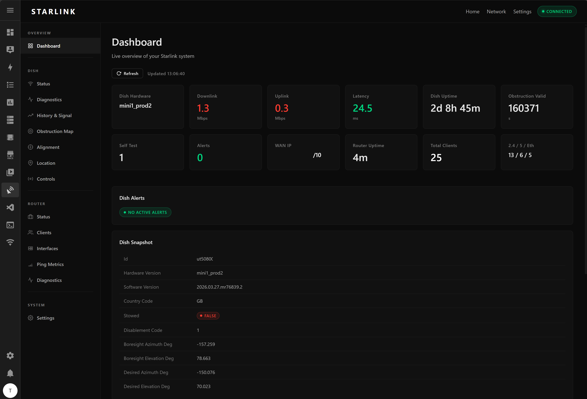

# timmchugh11's Home Assistant Add-on Repository

A collection of Home Assistant add-ons.

## Installation

1. Navigate to **Settings → Add-ons → Add-on Store** in Home Assistant.
2. Click the three-dot menu (⋮) in the top-right and choose **Repositories**.
3. Paste the URL of this repository and click **Add**.
4. Refresh the page, then find any of the add-ons below and click **Install**.

## Add-ons

### copyparty

Portable file server with resumable uploads, dedup, WebDAV, FTP, SFTP, media indexer,
thumbnails and more — accessible from any web browser.

**[Documentation](copyparty/DOCS.md)** · Upstream: [github.com/9001/copyparty](https://github.com/9001/copyparty)

---

### Starlink GUI

Full router-style admin interface for your local Starlink dish and WiFi router. Connects
directly to the dish via gRPC — no Starlink account or internet access required.
Includes a bypass mode to hide all router pages when the Starlink router is not in use.

**[Documentation](starlink_gui/README.md)**

---

### Van Power 3D

3D van power dashboard add-on with a rotating GLB model, Home Assistant sensor overlays,
and a hosted `custom:van-power-card` Lovelace module for the same visual layout inside dashboards.

**[Documentation](van_model/README.md)**

---

### Hostapd AP

Warning: This is a personal project and is not production-hardened. It can and will break the host network configuration while testing or applying AP/NAT/bridge changes.

WiFi access point managed via a built-in web UI. Supports routed/NAT mode and an
experimental bridge mode, with NAT as the recommended default.
Supports independent 2.4 GHz and 5 GHz radios. 6 GHz capability is detected in logs,
but 6 GHz AP controls are currently hidden while support is being revisited. Requires a WiFi adapter with AP mode support.

**[Documentation](hostapd/README.md)**

---

## Support

For issues with any add-on, open an issue in this repository.
