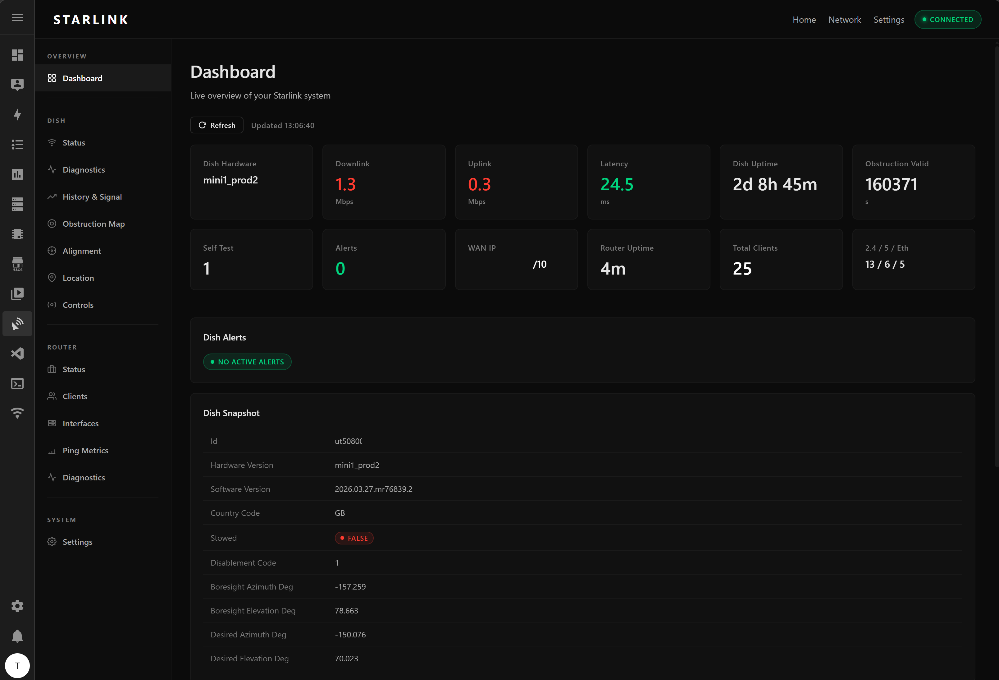

# Starlink GUI

Starlink GUI is a Home Assistant add-on that exposes a local web interface for a
Starlink dish and Starlink router over the local gRPC APIs.

It is designed to run inside Home Assistant with ingress enabled, so the UI can
open directly from the HA sidebar without publishing a separate public endpoint.

## What It Does



- Live dashboard with dish and router summary cards
- Bundled Lovelace custom card module for the combined Starlink page
- Dish pages for:
  - status
  - diagnostics
  - history and signal charts
  - 3D interactive sky obstruction map
  - 3D interactive alignment view (actual vs desired boresight)
  - Standalone obstruction and alignment pages for embedding in HA dashboard cards
  - basic controls (`reboot`, `stow`, `unstow`)
- Router pages for:
  - status
  - connected clients
  - interfaces
  - ping metrics
  - diagnostics
- Auto-refresh support in the web UI
- **Bypass mode** — when the Starlink router is absent or bypassed, router pages
  are still visible and populated from an OpenWrt router via its ubus API
- **OpenWrt integration** — pulls router data (WAN/LAN, uptime, client counts,
  interfaces) and wireless client data from an OpenWrt router over ubus JSON-RPC
- **Zyxel AP support** — if a `zyxel.ap` ubus bridge is registered on OpenWrt,
  wireless clients are fetched from there with band/signal/rate detail; DHCP
  leases fill in ethernet-only clients automatically
- Home Assistant ingress support, with optional direct access on port `3000`

The UI is read-heavy by design. Dish control actions are available, but router
write/config actions are not exposed in the frontend.

## Requirements

- Home Assistant must be able to reach your Starlink devices on the local network
- The dish and router gRPC interfaces must be reachable from the HA host
- Typical defaults are:
  - dish: `192.168.100.1:9200`
  - router: `192.168.1.1:9000`

If Starlink is in bypass mode, or Home Assistant is on a different subnet, you
may need static routes or different IP settings.

## Add-on Configuration

| Option | Default | Description |
|---|---|---|
| `dish_host` | `192.168.100.1` | Starlink dish IP address |
| `dish_port` | `9200` | Dish gRPC port |
| `router_host` | `192.168.1.1` | Starlink router IP address |
| `router_port` | `9000` | Router gRPC port |
| `bypass_mode` | `false` | Set `true` when the Starlink router is absent or bypassed — router pages will show OpenWrt data instead of Starlink gRPC data |
| `openwrt_fill_router_blanks` | `false` | Enable OpenWrt as the data source for router pages (requires `bypass_mode: true`) |
| `openwrt_host` | `192.168.1.1` | OpenWrt router IP address |
| `openwrt_protocol` | `http` | `http` or `https` |
| `openwrt_username` | `root` | OpenWrt ubus login username |
| `openwrt_password` | _(empty)_ | OpenWrt ubus login password |

These values are read at add-on startup from HA options and cannot be changed
from the web UI — restart the add-on after changing them in HA.

## Bypass Mode

When `bypass_mode: true` is set, the Starlink router gRPC endpoint is not
contacted. The router section of the dashboard and all router sub-pages remain
visible in the sidebar.

If `openwrt_fill_router_blanks: true` is also set, the router pages are
populated with data from the OpenWrt router via ubus JSON-RPC:

| Router page | OpenWrt source |
|---|---|
| Status | `system.board`, `system.info`, `network.interface dump` |
| Clients | `zyxel.ap get_clients` (with DHCP lease merge) or `luci-rpc.getDHCPLeases` |
| Interfaces | `network.device status` |
| Networks | `network.interface dump` |
| Diagnostics | Not available in bypass mode |
| Ping metrics | Not available in bypass mode |

The Settings page shows the current bypass state as a read-only indicator.

## OpenWrt ubus Connection

The add-on connects to OpenWrt's ubus JSON-RPC endpoint at
`{openwrt_protocol}://{openwrt_host}/ubus`. It uses zero-session login
(`session.login`) with the configured username and password.

No special ACL setup is required for most data. The only exception is direct
`/tmp/dhcp.leases` file access (not used by default — `luci-rpc.getDHCPLeases`
is used instead, which works out of the box if `luci-rpc` is installed).

## Zyxel AP Client Data (via OpenWrt ubus)

If a `zyxel.ap` ubus service is registered on OpenWrt, the clients page uses it
to provide band-accurate wireless client data:

- `zyxel.ap get_clients` — returns all connected wireless stations with MAC,
  IP, band (2.4 GHz / 5 GHz), SSID, signal strength, TX/RX rates, and capability
- DHCP leases (`luci-rpc.getDHCPLeases`) are merged in to cover ethernet-only
  clients — any MAC in DHCP but not in the AP list is classified as ethernet

This gives a complete merged client table covering all wired and wireless devices
without requiring direct HTTP access to the AP.

## Access

- Preferred: open through Home Assistant ingress / sidebar
- Optional: direct access on port `3000`

Port `3000/tcp` is declared in the add-on config. Depending on your HA setup,
you can leave it internal and use ingress only.

## UI Notes

- The default UI auto-refresh interval is `20` seconds
- Device address overrides in the settings page are session-only (browser `localStorage`)
- Router pages are based on the fields your Starlink firmware actually returns;
  some fields may be sparse depending on hardware and firmware version
- In bypass mode, the Settings page shows a read-only status indicator for
  bypass/OpenWrt state — these are controlled from HA add-on options, not the UI

## Lovelace Resource

Add the bundled module as a Lovelace resource:

`/local/starlink-gui/starlink-combined-card.js`

The add-on publishes this file into Home Assistant's `www` folder at startup, so
Lovelace can always load the card module from Home Assistant's `/local` path.

Then use:

```yaml
type: custom:starlink-combined-card
title: Starlink
aspect_ratio: 16:9
```

Optional card fields:

- `height`: fixed iframe height such as `420px`
- `ingress_path`: manual ingress path override if automatic discovery is unavailable
- `dish_host`: override the dish host for this card only
- `dish_port`: override the dish gRPC port for this card only
- `router_host`: override the router host for this card only
- `router_port`: override the router gRPC port for this card only

Important:

- The card JavaScript is served from `/local`, but the embedded Starlink page still uses Home Assistant ingress.
- If the ingress session is not active on a device, the card shows a custom fallback with a retry button instead of exposing the raw `401 Unauthorized` page.
- When the add-on UI is opened through ingress, it stores the current ingress path in browser `localStorage` so the `/local` card can reuse it on later loads before falling back to Supervisor API discovery.

## Sky Obstruction Map

The obstruction map page shows a live interactive 3D view of the sky above your
dish, rendered from the signal data reported by the dish firmware.

- **Drag** to rotate the view
- **Scroll** to zoom in and out
- **Reset View** button returns to the default orientation
- Cell colours: clear/tracked cells are shown in the "clear" colour, obstructed
  cells (SNR < 0.02) are shown in the "obstructed" colour
- Stats below the map show: **Tracked** cells, **Obstructed** cells (only shown
  when non-zero), and **Untracked** cells (within the dish boundary but with no
  reported signal data)

### Obstruction Map Colour Settings

The cell colours can be customised in the **Settings** page under
**Obstruction Map Colours**:

| Setting | Default | Description |
|---|---|---|
| Clear / Good Signal | `#42e0f5` (cyan) | Colour for cells with a clear sky view |
| Obstructed | `#f7524a` (red) | Colour for cells blocked by obstructions |

Colours are saved to browser `localStorage` and applied immediately.

## API Surface

The backend exposes internal JSON endpoints used by the frontend:

- Dish:
  - `/api/dishy/status`
  - `/api/dishy/diagnostics`
  - `/api/dishy/history`
  - `/api/dishy/obstruction-map`
  - `/api/dishy/alignment`
  - `/api/dishy/reboot`
  - `/api/dishy/stow`
  - `/api/dishy/unstow`
- Router (Starlink gRPC or OpenWrt in bypass mode):
  - `/api/router/status`
  - `/api/router/clients`
  - `/api/router/networks`
  - `/api/router/interfaces`
  - `/api/router/ping-metrics`
  - `/api/router/diagnostics`
- OpenWrt debug endpoints (not used by normal UI):
  - `/api/openwrt/status`
  - `/api/openwrt/clients`
  - `/api/openwrt/interfaces`
- Config:
  - `/api/config` — returns active dish/router defaults, `bypassMode`, and `openwrtFillRouterBlanks`

## Local Development

The add-on is a small Node/Express app using:

- `express`
- `cors`
- `@gibme/starlink`

Basic run flow:

```bash
npm install
npm start
```

The server serves the UI from `public/index.html` and proxies requests to the
local Starlink devices. Set environment variables to override defaults:

```bash
DISH_HOST=192.168.100.1 DISH_PORT=9200 \
ROUTER_HOST=192.168.1.1 ROUTER_PORT=9000 \
BYPASS_MODE=false \
OPENWRT_FILL_ROUTER_BLANKS=false \
OPENWRT_HOST=192.168.1.1 OPENWRT_PROTOCOL=http \
OPENWRT_USERNAME=root OPENWRT_PASSWORD=secret \
npm start
```

A `test_endpoint.py` script is included for smoke-testing the server endpoints
and direct OpenWrt ubus connectivity (requires `pip install requests`):

```bash
python test_endpoint.py --no-dish --no-server   # ubus only
python test_endpoint.py                          # full test
```

## Current Version

The add-on version is `1.1.36`.
